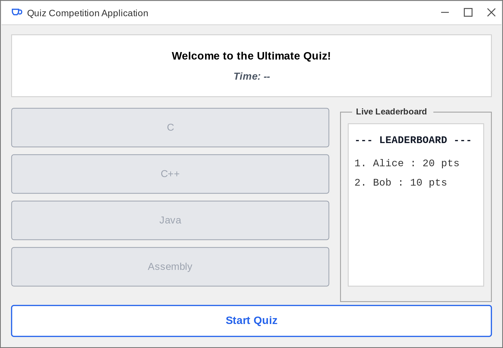
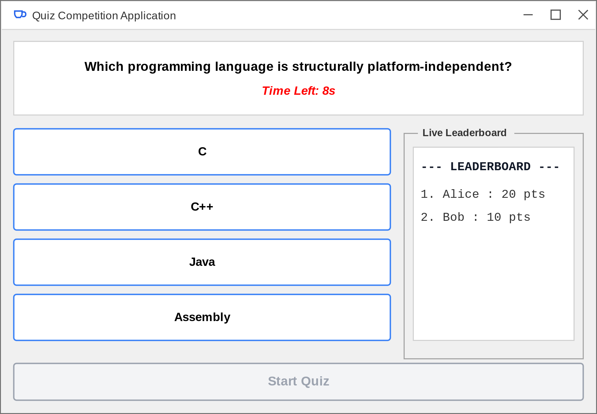
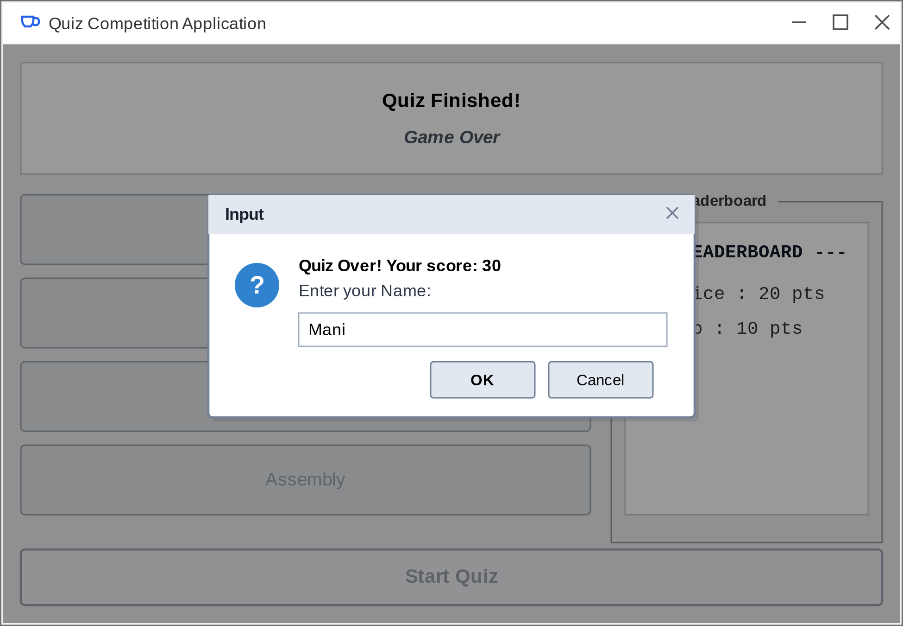
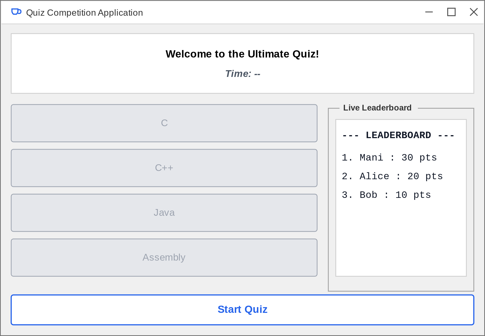

# 📝 Quiz Competition Application

A highly responsive, concurrent, and interactive desktop GUI Quiz Application engineered entirely in Java. This project combines Java Swing, multi-threading (to run background countdown timers), and the Java Collections Framework to deliver a seamless, zero-lag testing experience with a live, dynamically sorted scoreboard.

---

## 📖 Project Description

Traditional desktop examination and quiz systems often experience visual lag or freeze-ups because they run background timers and user input events on a single execution thread. This project solves that problem by using a multi-threaded architecture:

*   **The Main GUI Thread (Event Dispatch Thread - EDT):** Handles all visual layouts, rendering, and click events smoothly.
*   **The Background Timer Thread:** Spawns a dedicated background loop for each question, ticking down from 10 seconds without interfering with the user interface.

Additionally, the application leverages the Java Collections Framework (`ArrayList` and `HashMap`) to hold the question bank and track high scores. At the end of a quiz, the system processes player scores, updates a central leaderboard, sorts rankings dynamically in descending order, and renders the updated standings immediately in a scrollable sidebar.

---

## ✨ Features

*   **Interactive Swing Dashboard:** Rich, native window structures featuring dynamic question boxes, multiple-choice buttons, and a structured leaderboard panel.
*   **Multi-threaded Background Timer:** Individual 10-second countdowns per question. It catches thread interruptions cleanly to prevent thread collisions or duplicate clock processes.
*   **Thread-Safe UI Operations:** Delegates background state changes back to the main thread safely using `SwingUtilities.invokeLater()`.
*   **In-Memory Storage & Score Sorting:** Uses an `ArrayList` to manage the question pool, and maps player usernames and scores inside a `HashMap`, which is auto-sorted on the fly.
*   **Safe Input Validation:** Validates player inputs against nulls, blank inputs, and empty spaces using `trim().isEmpty()` before saving them to the scoreboard.

---

## 💻 Software Requirements

To compile and run this application locally, you will need:

*   **Operating System:** Windows 10/11, macOS, or Linux (cross-platform compatible).
*   **Java Development Kit (JDK):** Version 8 or higher (JDK 11, 17, or 21 recommended).
*   **Integrated Development Environment (IDE):** Eclipse, NetBeans, IntelliJ IDEA, or VS Code (optional but recommended).
*   **Command Line Tools:** Standard Java Compiler (`javac`) and Java Runtime Launcher (`java`).

---

## 🚀 Steps to Run the Project

Follow these commands to clone, compile, and run the application locally on your workstation:

### 1. Clone the Repository
```bash
git clone https://github.com/JGovardhan2007/QuizApplication-Java.git
cd QuizApplication-Java
```
*(Note: Ensure your code file `QuizApplication.java` is present in this directory!)*

### 2. Compile the Source Code
Compile the main Java source file using the Java compiler:
```bash
javac QuizApplication.java
```

### 3. Run the Application
Execute the compiled bytecode class inside the Java Virtual Machine (JVM):
```bash
java QuizApplication
```

---

## 📸 Screenshots

Below are the visual state flows captured from the active application. 


| Welcome Interface | Active Gameplay |
| :---: | :---: |
|  <br> *Figure 6.1* |  <br> *Figure 6.2* |

| Name Input Dialog | Updated Scoreboard |
| :---: | :---: |
|  <br> *Figure 6.3* |  <br> *Figure 6.4* |

